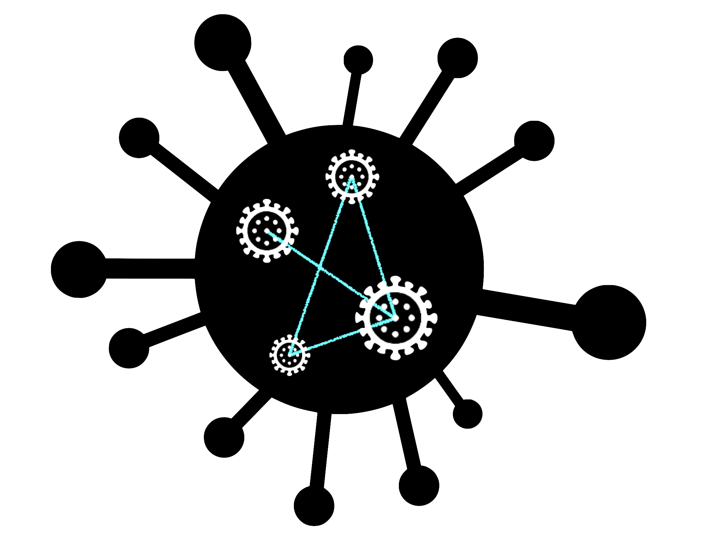

<!-- PROJECT LOGO -->
 

  

<h3 align="center">Spread of diseases in contact networks</h3>

  

    A project modelling the spread of infectious diseases via contact networks
     
    <a href="https://example.com"><strong>Explore the docs »</strong></a>
     
     
    <a href="#usage">View Demo</a>
    ·
    <a href="https://gitlab.rhrk.uni-kl.de/prokosch/fachpraktikum/issues">Report Bug</a>
    ·
    <a href="https://gitlab.rhrk.uni-kl.de/prokosch/fachpraktikum/issues">Request Feature</a>
  

<!-- TABLE OF CONTENTS -->

  
Table of contents

  <ol>
    <li>
      <a href="#about-the-project">About this project</a>
      <ul>
        <li><a href="#built-with">Built with</a></li>
        <li><a href="#usage">Usage</a></li>
        <li><a href="#roadmap">Roadmap</a></li>
      </ul>
    </li>
    <li><a href="#license">License</a></li>
    <li><a href="#contact">Contact</a></li>
  </ol>

<!-- ABOUT THE PROJECT -->
## About The Project

Here's a blank template to get started: To avoid retyping too much info.

(<a href="#top">back to top</a>)

### Built With

* [Python](https://www.python.org/)

(<a href="#top">back to top</a>)

### Usage

Use this space to show useful examples of how a project can be used. Additional screenshots, code examples and demos work well in this space. You may also link to more resources.

_For more examples, please refer to the [Documentation](https://example.com)_

(<a href="#top">back to top</a>)

<!-- ROADMAP -->
### Roadmap

- [] Feature 1
- [] Feature 2
- [] Feature 3
    - [] Nested Feature

See the [open issues](https://gitlab.rhrk.uni-kl.de/prokosch/fachpraktikum/issues) for a full list of proposed features (and known issues).

(<a href="#top">back to top</a>)

<!-- LICENSE -->
## License

Distributed under the MIT License. See `LICENSE.txt` for more information.

(<a href="#top">back to top</a>)

<!-- CONTACT -->
## Contact

Tim Prokosch - prokosch@rhrk.uni-kl.de  
Tobias Roth - tproth@rhrk.uni-kl.de

Project Link: [https://gitlab.rhrk.uni-kl.de/prokosch/fachpraktikum](https://gitlab.rhrk.uni-kl.de/prokosch/fachpraktikum)

(<a href="#top">back to top</a>)

