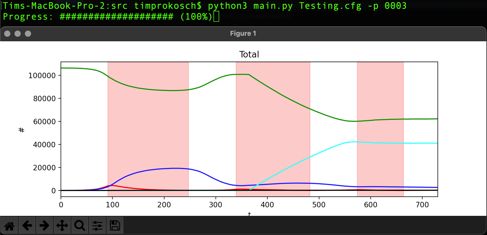

<div id="top"></div>
<!-- PROJECT LOGO -->
<br />
<div align="center">
  <a href="https://github.com/AlbertEMC2Stein/COVID19-CNS">
    
  </a>

<h3 align="center">Spread of diseases in contact networks</h3>

  <p align="center">
    A project modelling the spread of infectious diseases via contact networks
    <br />
    <a href="https://albertemc2stein.github.io/COVID19-CNS/docs"><strong>Explore the docs »</strong></a>
    <br />
    <br />
    <a href="#usage">View Demo</a>
    ·
    <a href="https://github.com/AlbertEMC2Stein/COVID19-CNS/issues">Report Bug</a>
    ·
    <a href="https://github.com/AlbertEMC2Stein/COVID19-CNS/issues">Request Feature</a>
  </p>
</div>


<!-- TABLE OF CONTENTS -->
<details>
  <summary>Table of contents</summary>
  <ol>
    <li>
      <a href="#about-the-project">About this project</a>
      <ul>
        <li><a href="#usage">Usage</a></li>
        <li><a href="#roadmap">Roadmap</a></li>
      </ul>
    </li>
    <li><a href="#license">License</a></li>
    <li><a href="#contact">Contact</a></li>
  </ol>
</details>


<!-- ABOUT THE PROJECT -->
## About The Project

This project gives the user the ability to simulate customizable 
infection precesses using the many offered parameters that
can be easily accessed (as seen <a href="./src/Settings/Template.cfg">here</a>)
and edited. Additionally, some post-processing methods are presented to
analyze the outputted data, either directly after the simulation or at a later point
in time.

<div align="right">(<a href="#top">back to top</a>)</div>


### Usage




To start a simulation just use the ```python3 main.py SETTINGS_FILE_NAME.cfg``` command in your terminal from inside
the src folder of the project. To only execute the in the config file specified post-processing methods on the specified 
population use ```python3 main.py SETTINGS_FILE_NAME.cfg -p SIMULATION_NUMBER```.

_For more examples, please refer to the [Documentation](https://albertemc2stein.github.io/COVID19-CNS/docs)_

<div align="right">(<a href="#top">back to top</a>)</div>


<!-- ROADMAP -->
### Roadmap

- More post-processing
- More heuristics
- More features
    - Randomly picked interactions 
    - More measures like mask-duty
    - Hospitalisation and infection severity
- Bigger populations (all of Germany?)
- Different virus variants

See the [open issues](https://github.com/AlbertEMC2Stein/COVID19-CNS/issues) for a full list of proposed features (and known issues).

<div align="right">(<a href="#top">back to top</a>)</div>


<!-- LICENSE -->
## License

Distributed under the MIT License. See `LICENSE.txt` for more information.

<div align="right">(<a href="#top">back to top</a>)</div>


<!-- CONTACT -->
## Contact

Tim Prokosch - prokosch@rhrk.uni-kl.de </br>
Tobias Roth - tproth@rhrk.uni-kl.de

Project Link: [https://github.com/AlbertEMC2Stein/COVID19-CNS](https://github.com/AlbertEMC2Stein/COVID19-CNS)

<div align="right">(<a href="#top">back to top</a>)</div>
